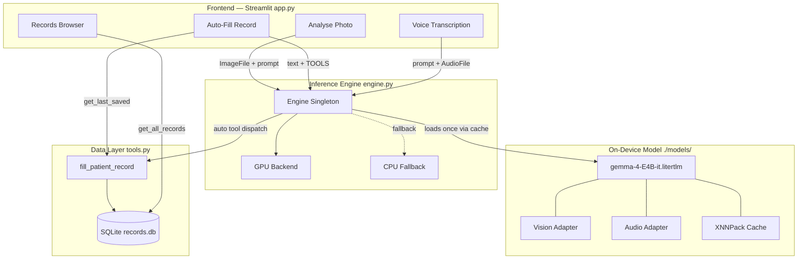
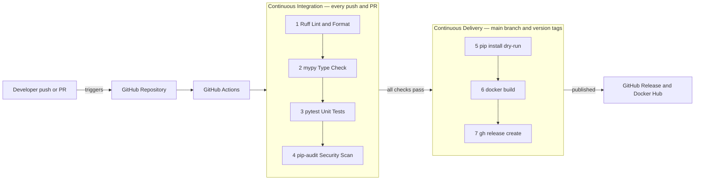

# Saathi — Offline Rural Health Assistant

<div align="center">


[](https://huggingface.co/spaces/ankit79600/saathi)

**Fully offline triage & documentation aide for rural healthcare workers.**  
Vision · Voice · Structured records — all on-device via Gemma 4 E4B + LiteRT-LM.

[Live Demo](https://huggingface.co/spaces/ankit79600/saathi) · [Demo Video](https://youtu.be/Z1a5H0NCNEY) · [Kaggle Hackathon — Kolkata 2026](#)

</div>

---

## Table of Contents

- [What it does](#what-it-does)
- [System Architecture](#system-architecture)
- [Frontend](#frontend)
- [Backend](#backend)
- [Data Layer](#data-layer)
- [CI/CD Pipeline](#cicd-pipeline)
- [Project Structure](#project-structure)
- [Setup](#setup)
- [Stack](#stack)
- [How Gemma 4 is Used](#how-gemma-4-is-used)
- [Environment Variables](#environment-variables)

---

## What it does

| Tab | Feature |
|-----|---------|
| 📷 Analyse Photo | Photograph a wound, rash, or prescription — Gemma describes it for the record |
| 📝 Auto-Fill Record | Describe a patient in plain language — Gemma extracts structured fields and saves to SQLite |
| 🎙️ Voice | Upload a voice note (≤30 s) in English, Bengali, or Hindi — transcribed on-device |
| 📋 Records | Browse all saved patient records, colour-coded by severity |

---

## System Architecture



### Data-Flow Narrative

```
User action
  → Streamlit tab collects input (image / text / audio)
    → engine.new_conversation() opens a fresh LiteRT-LM Conversation
      (shared model weights, isolated KV-cache per request)
        → Gemma 4 E4B runs on-device (GPU or CPU)
          → plain-text response  OR  tool call to fill_patient_record()
            → result rendered in UI  +  optional SQLite write
```

---

## Frontend

The entire UI lives in **`app.py`** — a single Streamlit script with four tabs.

### Model warm-up

```python
@st.cache_resource(show_spinner="Loading Gemma 4 E4B on-device…")
def _warmup():
    engine.load_model()
    return True
```

`@st.cache_resource` ensures the model is loaded exactly once per process; all subsequent Streamlit re-runs skip the heavy load and reuse the cached singleton.

### Tab 1 — Analyse Photo

- Accepts camera capture (`st.camera_input`) or file upload (`jpg`, `jpeg`, `png`).
- Writes bytes to a `tempfile.NamedTemporaryFile`; the extension is inferred from the uploaded filename so the model receives the correct MIME type.
- Passes `litert_lm.Content.ImageFile(absolute_path=path)` **before** the text prompt — the order required by Gemma 4's model card for vision tasks.
- The resulting description is stored in `st.session_state["vision_text"]` so it can automatically seed Tab 2.

### Tab 2 — Auto-Fill Record

- Pre-fills the text area from `session_state["vision_text"]` if a photo was just analysed or a voice note was just transcribed.
- Passes `TOOLS = [fill_patient_record]` to `engine.new_conversation(tools=TOOLS)`.
- LiteRT-LM derives the JSON function schema from Python type hints and docstrings at runtime — no manual JSON authoring.
- After Gemma calls the tool, `get_last_saved()` returns the newly persisted row for immediate display.

### Tab 3 — Voice Transcription

- Accepts `.wav` uploads (≤ 30 s recommended).
- Language selector: English, Bengali, Hindi.
- Prompt structure: `text prompt → AudioFile` — **text before audio** per ASR model card guidance.
- Output seeds `session_state["vision_text"]` for Tab 2.

### Tab 4 — Records Browser

- Reads all rows from `records.db` via `get_all_records()`.
- Severity colour coding: 🔴 high / 🟡 medium / 🟢 low.
- Each `st.expander` shows name, age, symptoms, severity, notes, and ISO-8601 timestamp.

---

## Backend

### `engine.py` — Inference Engine

```
_find_model_path()     checks $SAATHI_MODEL_PATH → scans ./models/*.litertlm
load_model()           GPU-first singleton loader; CPU fallback on exception
new_conversation()     context manager → yields a fresh LiteRT-LM Conversation
```

**Singleton pattern** — `_model` is a module-level variable, so repeated Streamlit re-runs reuse the already-loaded model without touching disk again.

**GPU → CPU fallback** — iterates `[Backend.GPU(), Backend.CPU()]` and uses the first backend that succeeds. Raises only when both fail.

**Context manager** — `new_conversation()` gives each user action its own Conversation object (isolated KV cache / context window) while sharing the heavy model weights across all requests.

```python
@contextlib.contextmanager
def new_conversation(tools: list | None = None):
    model = load_model()
    kwargs = {"tools": tools} if tools else {}
    convo = model.create_conversation(**kwargs)
    yield convo
```

### `tools.py` — Function-Calling Layer

```
fill_patient_record()  validates severity, writes to SQLite, sets thread-local last_saved
get_last_saved()       returns the record saved most recently on this thread
get_all_records()      full table read, newest-first
_init_db()             idempotent CREATE TABLE IF NOT EXISTS
```

**Thread safety** — `threading.local()` isolates `last_saved` per Streamlit session thread so concurrent users never see each other's records.

**Schema generation** — LiteRT-LM inspects the callable's signature and docstring at runtime to build the JSON tool schema automatically. No `tools=[{"type": "function", ...}]` JSON required.

---

## Data Layer

```
records.db  (SQLite — single file, no server)
└── patients
    ├── id        INTEGER  PRIMARY KEY AUTOINCREMENT
    ├── created   TEXT     ISO-8601  e.g. "2026-07-05T14:32:01"
    ├── name      TEXT
    ├── age       INTEGER
    ├── symptoms  TEXT
    ├── severity  TEXT     'low' | 'medium' | 'high'
    └── notes     TEXT     optional
```

The database is created automatically on first use (`_init_db` is idempotent). It lives alongside `app.py` and persists across restarts. No migrations needed — schema is fixed.

---

## CI/CD Pipeline



### Pipeline Stage Details

| Stage | Tool | Runs on | Purpose |
|-------|------|---------|---------|
| Lint | `ruff check .` | every push & PR | Enforce PEP 8 + E/W/F rules |
| Format | `ruff format --check .` | every push & PR | Consistent code style |
| Type check | `mypy app.py engine.py tools.py` | every push & PR | Catch type errors before runtime |
| Unit tests | `pytest tests/ -v` | every push & PR | Verify tool logic, DB schema, model discovery |
| Security scan | `pip-audit -r requirements.txt` | every push & PR | Flag known CVEs in dependencies |
| Clean install | `pip install --dry-run` | main branch | Confirm `requirements.txt` installs cleanly |
| Docker build | `docker build .` | version tag `v*` | Build reproducible runtime image |
| Release | `gh release create` | version tag `v*` | Publish changelog + wheel + Docker tag |

### GitHub Actions — CI Workflow

```yaml
# .github/workflows/ci.yml
name: CI
on: [push, pull_request]

jobs:
  lint-type-test:
    runs-on: ubuntu-latest
    steps:
      - uses: actions/checkout@v4

      - uses: actions/setup-python@v5
        with:
          python-version: "3.11"

      - name: Install dev tools
        run: pip install ruff mypy pytest pip-audit

      - name: Lint
        run: ruff check .

      - name: Format check
        run: ruff format --check .

      - name: Type check
        run: mypy app.py engine.py tools.py --ignore-missing-imports

      - name: Unit tests
        run: pytest tests/ -v

      - name: Security scan
        run: pip-audit -r requirements.txt
```

> **Note:** LiteRT-LM and the `.litertlm` model file are not available in headless CI. Unit tests mock `litert_lm.Engine` so the pipeline runs fast without GPU hardware.

### Branch Protection Rules (recommended)

```
main branch:
  ✅ Require status checks to pass (lint-type-test)
  ✅ Require branches to be up-to-date before merging
  ✅ Restrict direct pushes — PRs only
```

---

## Project Structure

```
Saathi/
│
├── app.py                          # Streamlit entry point — 4-tab UI
├── engine.py                       # LiteRT-LM Engine singleton + conversation context manager
├── tools.py                        # fill_patient_record() tool + SQLite read helpers
├── requirements.txt                # Runtime dependencies (3 packages)
├── records.db                      # SQLite database — auto-created on first run
│
├── models/                         # On-device model files (download separately)
│   ├── gemma-4-E4B-it.litertlm                                    # Main quantized weights
│   ├── gemma-4-E4B-it.litertlm.vision_adapter.xnnpack_cache_*    # Vision encoder cache
│   ├── gemma-4-E4B-it.litertlm.static_audio_encoder.xnnpack_*   # ASR encoder cache
│   ├── gemma-4-E4B-it.litertlm.audio_adapter.xnnpack_cache_*    # Audio adapter cache
│   ├── gemma-4-E4B-it.litertlm.xnnpack_cache_*                  # Main XNNPack cache
│   ├── gemma-4-E4B-it.litertlm_*_mldrift_program_cache.bin      # MLDrift compiled kernels
│   ├── gemma-4-E4B-it.litertlm_*_mldrift_weight_cache.bin       # MLDrift weight cache
│   ├── chat_template.jinja                                        # Gemma 4 chat template
│   ├── notebook.ipynb                                             # Exploration notebook
│   └── README.md                                                  # Model card (HF mirror)
│
├── .github/
│   └── workflows/
│       ├── ci.yml                  # Lint → type → test → security  (every push / PR)
│       └── release.yml             # Docker build + GitHub Release  (version tags)
│
├── tests/                          # (recommended) Unit test suite
│   ├── test_tools.py               # fill_patient_record, severity validation, DB schema
│   └── test_engine.py              # model discovery, GPU→CPU fallback (mocked litert_lm)
│
├── .gitignore                      # Ignores venv/, models/*.litertlm, records.db, __pycache__
└── venv/                           # Python virtual environment (git-ignored)
```

### Key File Roles at a Glance

| File | Responsibility |
|------|---------------|
| `app.py` | UI layout, tab routing, session state, temp file handling |
| `engine.py` | Model lifecycle (load once, yield conversations, GPU/CPU fallback) |
| `tools.py` | Data persistence, function-call schema source-of-truth, thread safety |
| `requirements.txt` | Minimal pinned runtime deps: `litert-lm`, `streamlit`, `huggingface_hub` |
| `records.db` | Append-only patient record store; created by `_init_db()` |

---

## Setup

**1. Clone the repo**
```bash
git clone https://github.com/ankit79600/saathi.git
cd saathi
```

**2. Create and activate a virtual environment**
```bash
python -m venv venv

# Windows
venv\Scripts\activate

# macOS / Linux
source venv/bin/activate
```

**3. Install dependencies**
```bash
pip install -r requirements.txt
```

**4. Download the model** (one-time, ~4 GB — requires a free Hugging Face account)
```bash
# Accept the Gemma license at huggingface.co/litert-community/gemma-4-E4B-it-litert-lm
huggingface-cli login
huggingface-cli download litert-community/gemma-4-E4B-it-litert-lm --local-dir ./models
```

**5. Run**
```bash
streamlit run app.py
```

App opens at `http://localhost:8501`.  
The first load shows a **"Loading Gemma 4 E4B on-device…"** spinner while the model is compiled into XNNPack kernel caches for your hardware — subsequent starts reuse the cache and are significantly faster.

---

## Stack

| Layer | Technology | Version | Role |
|-------|-----------|---------|------|
| **UI framework** | Streamlit | ≥ 1.35 | 4-tab SPA; camera, file upload, `session_state` |
| **On-device inference** | LiteRT-LM | ≥ 0.1 | Engine, Conversation, tool dispatch, backend selection |
| **Language model** | Gemma 4 E4B (`.litertlm`) | — | 4 B-param multimodal LLM; text + vision + audio |
| **Vision backend** | LiteRT-LM vision adapter | — | XNNPack-compiled vision encoder |
| **Audio backend** | LiteRT-LM audio adapter | — | On-device ASR — English, Bengali, Hindi |
| **Function calling** | LiteRT-LM auto-schema | — | JSON schema derived from Python type hints + docstrings |
| **Storage** | SQLite (stdlib) | — | Local patient records; zero-config, no server |
| **Model hub** | `huggingface_hub` | ≥ 0.23 | One-time model download via CLI |
| **Language** | Python | 3.10+ | — |
| **CI linter** | Ruff | latest | PEP 8 + style enforcement |
| **CI type checker** | mypy | latest | Static type analysis |
| **CI test runner** | pytest | latest | Unit / integration tests |
| **CI security** | pip-audit | latest | CVE scanning of dependencies |
| **CI/CD runtime** | GitHub Actions | — | Automated pipeline on push / PR / tag |

---

## How Gemma 4 is Used

### Vision (image before text)

Gemma 4's multimodal input analyses patient photos and medical documents.  
The image must be passed **before** the text prompt — required by the model card:

```python
resp = convo.send_message(litert_lm.Contents.of(
    litert_lm.Content.ImageFile(absolute_path=path),  # image first
    "Objectively describe what is visible…",           # text second
))
```

### Audio / ASR (text before audio)

Voice notes are transcribed on-device in English, Bengali, and Hindi.  
The text prompt must come **before** the audio content per ASR model card guidance:

```python
resp = convo.send_message(litert_lm.Contents.of(
    f"Transcribe the following speech in {lang} text. "
    "Only output the transcription, with no newlines.",  # text first
    litert_lm.Content.AudioFile(absolute_path=apath),   # audio second
))
```

### Function Calling (auto JSON schema)

LiteRT-LM reads the function signature and docstring at runtime to build the tool schema.  
Gemma calls `fill_patient_record()` automatically — no manual JSON authoring:

```python
# tools.py — LiteRT-LM generates the schema from this at import time
def fill_patient_record(name: str, age: int, symptoms: str,
                        severity: str, notes: str = "") -> str:
    """Create a structured triage record for one patient and save it locally.

    Args:
        name:     Patient's full name.
        age:      Patient's age in years.
        symptoms: Observed or reported symptoms, in plain language.
        severity: Urgency level. Must be one of 'low', 'medium', 'high'.
        notes:    Any extra context for the clinician (optional).
    """
    ...

TOOLS = [fill_patient_record]  # passed to new_conversation(tools=TOOLS)
```

---

## Environment Variables

| Variable | Default | Description |
|----------|---------|-------------|
| `SAATHI_MODEL_PATH` | auto-detected | Absolute path to a `.litertlm` or `.task` model file |

```bash
# Windows
set SAATHI_MODEL_PATH=C:\path\to\gemma-4-E4B-it.litertlm

# macOS / Linux
export SAATHI_MODEL_PATH=/path/to/gemma-4-E4B-it.litertlm
```

If unset, `engine.py` scans `./models/` for `*.task` first, then `*.litertlm`, and uses the first match found.

---

> **Disclaimer:** Saathi is a documentation and triage aide only. It is not a diagnostic tool and should never replace clinical judgement.
